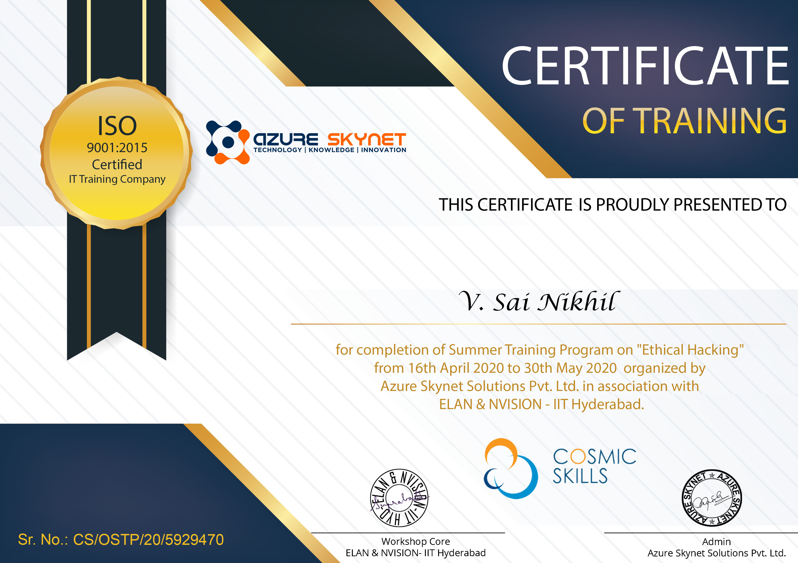

# Ethical-Hacking

This is my internship from Azure Skynet on Ethical Hacking. This is a 45 days internship and contain learning of the basics of ethical hacking which are:
* Introduction to Cyber Security
* Creating Your Virtual Lab
* Networking
* Information Gathering & Scanning
* Google Hacking
* Metasploit Framework
* Shodan
* Malwares
* WiFi Hacking
* Web App Security
* Denial of Service
* Cryptography
* Firewall,IDS &IPS

## Capstone Project

After the completion of course, there is a capstone project which has 3 sub topics.
* Scanning Network
  * Finding the targets
  * Scanning the ports
  * Vulnerability Scanning
* System Hacking
  * Passive System Hacking
  * Active System Hacking
* Cross Side Scripting

## Certificate of Completion

